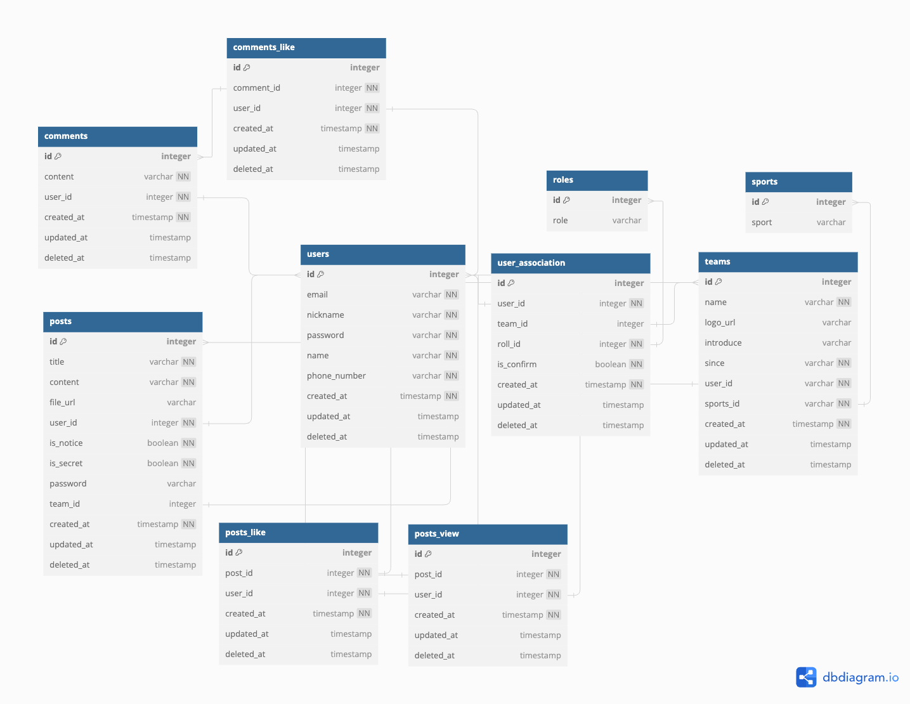

# 드림클럽 API

스포츠 팀에서 선수와 코칭스태프 간의 소통을 돕고, 훈련내용 및 선수의 훈련일지를 관리할 수 있는 플랫폼

## 프로젝트 정보

### 프로젝트 명칭

드림클럽 

### 개발인원

1명 

### 개발 기간

2024.05 ~ 2024.07 (약 6주) 

### 주요 기능

1. 회원가입
2. 로그인
3. 팀 별 게시판
4. 댓글
5. 알림 (추후 개발 예정)

### 개발 스택

  <table>
    <tr>
      <td>구분</td>
      <td>사용 스택</td>
    </tr>
    <tr>
      <td>Backend</td>
      <td>Nest.js, typeORM</td>
    </tr>
    <tr>
      <td>DataBase</td>
      <td>MySQL</td>
    </tr>
    <tr>
      <td>Infra</td>
      <td>AWS RDS, AWS EC2</td>
    </tr>
    <tr>
      <td>Tool</td>
      <td>pnpm, postman</td>
    </tr>
  </table>

### 도전 과제

1. 테스트 코드 작성
2. 로깅 데이터 관리
3. api key 발급 후, api 호출 가능하도록 구현
4. 추후 개발 계획
   1. admin 페이지 구현
   2. 소셜 로그인 구현

### 요구 사항 분석 (기획)

<table>
  <!--구분 -->
  <thead>
    <tr>
      <th>기능</th>
      <th style="background:grey">구분</th>
      <th>요구 사항</th>
    </tr>
  </thead>
  <!--회원 가입-->
    <tr>
      <td rowspan="50">회원가입 (쿠키, 세션, 토큰 모두 사용)</td>
      <td rowspan="3" style="background:grey">이메일</td>
      <td>공백 불가</td>
    </tr>
    <tr>
      <td>이메일 형식검사</td>
    </tr>
    <tr>
      <td>중복 검사</td>
    </tr>
    <!--닉네임 -->
    <tr>
      <td rowspan="3" style="background:grey">닉네임</td>
      <td>닉네임은 2~12자, -, \_를 제외한 모든 특수문자 금지</td>
    </tr>
    <tr>
      <td>공백 불가</td>
    </tr>
    <tr>
      <td>중복 검사</td>
    </tr>
    <!--비밀번호 -->
    <tr>
      <td style="background:grey">비밀번호</td>
      <td>6~20자, 형식 검사 (대문자 하나 이상 포함, 특수문자 하나 이상 포함)</td>
    </tr>
    <!--이름 -->
    <tr>
      <td style="background:grey">이름</td>
      <td>공백 불가</td>
    </tr>
    <!--팀 명 -->
    <tr>
      <td rowspan="2" style="background:grey">팀 명</td>
      <td>필수 X</td>
    </tr>
    <tr>
      <td>검색 기능 구현</td>
    </tr>
    <!--역할-->
    <tr>
      <td style="background:grey">역할</td>
      <td>코칭스태프 / 선수 / 학부모 / 기타로 나뉨</td>
    </tr>
     <!--핸드폰 번호 -->
    <tr>
      <td rowspan="3" style="background:grey">핸드폰 번호</td>
      <td>핸드폰 번호 형식 검사</td>
    </tr>
    <tr>
      <td>중복 검사</td>
    </tr>
    <tr>
      <td>숫자만 입력 가능</td>
    </tr>
     <!--종목-->
    <tr>
      <td style="background:grey">종목</td>
      <td>축구 / 농구 / 야구 / 배구로 나뉨</td>
    </tr>
</table>

2. 로그인
   1. 이메일
      1. 이메일 형식 검사
      2. 공백 불가
      3. 유무 판단
   2. 비밀번호
      1. 6~20자, 형식 검사 (대문자 하나 이상 포함, 특수문자 하나 이상 포함)
3. 팀 생성
   1. 팀 명
      1. 공백 불가
      2. 중복 검사
   2. 창단일
   3. 팀 로고
      1. webp 변환
   4. 한 줄 소개
   5. 감독
   6. 종목
4. 팀 별 게시판
   1. CRUD
   2. 제목 및 내용 공란 불가
   3. 사진 첨부 가능 (사진 첨부 시, 내용 상단에 고정)
   4. 게시자만 글 삭제 가능
   5. 공지글로 등록 시, 상단에 노출되어야 함
   6. 비밀 글 작성가능, 비밀번호 입력 가능 (숫자 6자)
   7. 조회 수 카운팅 (세션 당 하나 올리는 걸로 가능할지..?)
      1. 어떤 유저가 조회했는지 카운팅
      2. 3명까지 이름 노출, 이후는 +n 로 노출
      3. 조회 수 클릭 시, 조회한 유저의 이름 전체 노출
   8. 좋아요 기능
   9. 팀으로 등록 된 유저만 글에 접근 가능 (게시판 자체는 아무나 접근 가능)
5. 댓글
   1. CRUD
   2. 공란 불가
   3. 게시자만 글 삭제 가능
   4. 좋아요 기능
   5. 멘션 기능 (추후 개발 예정)
6. 마이 페이지
   1. 핸드폰 번호 변경
   2. 닉네임 변경
   3. 이름 변경
   4. 팀 변경
   5. 역할 변경
   6. 종목 변경
   7. 비밀번호 변경
   8. 아이디 찾기
   9. 비밀번호 찾기 / 재설정
7. 팀 페이지
   1. 팀 명 변경
   2. 창단일 변경
   3. 팀 로고 변경
   4. 소개 변경
   5. 감독 변경
   6. 종목 변경
   7. 선수 조회
      1. 미승인 선수 및 학부모 승인 api 필요
   8. 코칭스태프 조회
8. 프로필 페이지
   1.
9. 알림 (추후 개발 예정)
   1. 팀 별 게시판 글 생성 시
   2. 내가 쓴 글에 댓글 생성 시
   3. 나를 멘션한 댓글 생성 시

## 4. DB 설계

주소 : https://dbdiagram.io/d/dreamclub_erd-66503ca1f84ecd1d22083741

## 5. api 설계 (restful api)

1. 공통 사항
   1. 인증 인가 방식
      1. AUTH : 회원 유무 검증
      2. OWNER : 주로 리소스 삭제 시, 본인의 리소스인지 검증
      3. ROLE : 역할 검증
      4. TEAM : 팀에 소속된 유저인지 검증 (team_id와 user_association 테이블의 is_confirm 체크)
   2. 쿼리 스트링
      1. 명시 된 항목이 key가 되고, value를 채워서 url에 작성
      2. sort가 필요할 경우 카테고리\_정렬방식으로 작성
         1. name_desc (이름 내림차순), create_asc (생성일 오름차순)
         2. 2개 이상의 필터링이 걸릴 경우 콤마(,)로 구분
         3. ex) sort=name_desc,create_asc
2. end point
   1. auth
      1. (회원가입) POST /auth/register
      2. (로그인) POST /auth/login
   2. user
      1. (유저 정보 조회) GET /user/:userId
      2. (유저 정보 수정) PUT /user/:userId AUTH
      3. (유저 탈퇴) DELETE /user/:userId AUTH OWNER
      4. (팀 합류 승인) PUT /user/confirm/:userId AUTH ROLE TEAM
   3. team
      1. (팀 생성) POST /team AUTH
      2. (팀 정보 변경) PUT /team/:teamId AUTH TEAM ROLE
      3. (팀 정보 조회) GET /team/:teamId
      4. (팀 삭제) DELETE /team/:teamId AUTH TEAM OWNER ROLE
      5. (팀 리스트 조회) GET /team
         1. 쿼리 스트링
            1. offset (페이지)
            2. limit (갯수)
            3. sport (종목)
            4. name (팀명)
            5. since_start (창단일 범위 시작)
            6. since_end (창단일 범위 끝)
            7. staff (소속 스태프)
            8. sort (정렬방식)
               1. 정렬 카테고리: name / since
   4. post
      1. (게시글 생성) POST /post AUTH TEAM
      2. (게시글 수정) PUT /post AUTH TEAM OWNER
      3. (게시글 조회) GET /post/:postId AUTH TEAM
      4. (게시글 삭제) DELETE /post:postId AUTH OWNER TEAM
      5. (게시글 좋아요) POST /post/like/:postId AUTH TEAM
      6. (팀 별 게시글 목록 조회) GET /post/:teamId AUTH
         1. 쿼리 스트링
            1. offset (페이지)
            2. limit (갯수)
            3. name (작성자)
            4. title (제목)
            5. create_start (작성일 범위 시작)
            6. create_end (작성일 범위 끝)
            7. sort (정렬방식)
               1. 정렬 카테고리 : create
   5. comment
      1. (댓글 생성) POST /comment AUTH TEAM
      2. (댓글 수정) PUT /comment AUTH TEAM OWNER
      3. (댓글 삭제) DELETE /comment AUTH TEAM OWNER
      4. (댓글 좋아요) POST /comment/like/:postId AUTH TEAM
      5. (댓글 리스트 조회) GET /comment/:postId AUTH TEAM
         1. 쿼리 스트링
            1. offset (페이지)
            2. limit (갯수)

## 6. 일정

1. 6/21 개발 마무리 (약 4주)
   1. auth / user 1주
   2. team 1주
   3. post 1주
   4. comment 1주
2. 이후 7월 전까지 테스트코드 및 로깅 데이터 관리 도전과제 수행하기
3. 7월 첫째주 안으로 readme, 회고 작성 (틈틈히 리팩토링)
4. 최종 일정 (빠르면 빠를수록 좋음)
   1. auth / user (~5/31)
   2. team (~6/7)
   3. post (~6/14)
   4. comment (~6/21)
   5. test code / logging (~6/28)
   6. readme / 회고 / 이력서 (~7/5)

## 7. 관련 포스팅 자료

[1. Nest + TypeORM 환경에서 DTO 데코레이터, Exception, Exception Filter 커스텀 해보기](https://dev-robinkim-93.tistory.com/29)

[2. Typescript에서 상수 관리하기](https://dev-robinkim-93.tistory.com/30)
